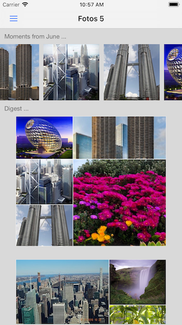

# Fotos5

This is a framework for an iOS image viewing app written in Swift 5. It demonstrates the use of many useful concepts such as Coordinators and UICollectionView flow layouts.

## License

Fotos5 is licensed under the MIT License. See the LICENSE file for more information, but basically this is sample code and you can do whatever you want with it.